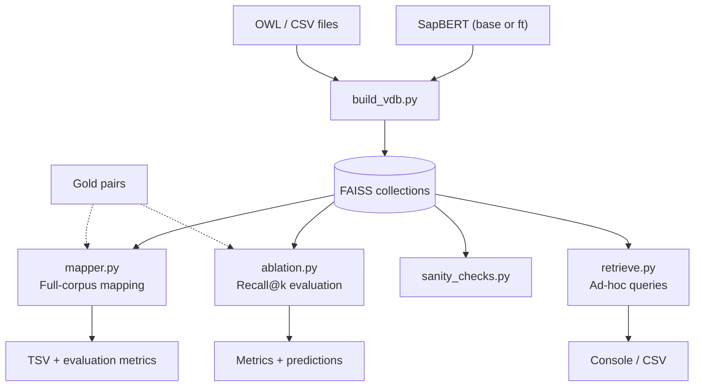
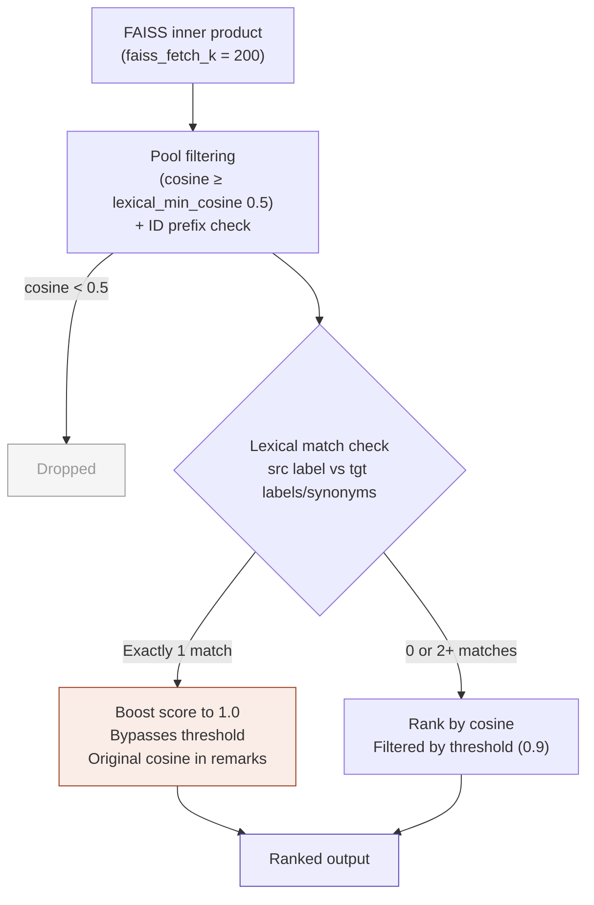

# Ontology Mapping via Semantic Retrieval

Cross-ontology concept mapping using fine-tuned SapBERT embeddings and FAISS similarity search. 
Given a source ontology (e.g., HPO) and a target ontology (e.g., MPO), the system identifies 
the best-matching target concept for every source concept based on semantic similarity of 
labels, definitions, and synonyms.

Supports multiple ontology pairs: HP↔MP, MONDO↔MeSH, MONDO↔DOID, ChEBI↔MeSH, with 
configurable ablation studies and full-corpus mapping runs evaluated against gold-standard 
alignments.

## Project Structure
```
project_root/
├── vdb_src/
│   ├── config.py          # All collection definitions, ablation/mapping presets, BuildConfig (This is the primary file to change)
│   ├── utils.py           # Embedding, FAISS I/O, OWL parsing, ranking, evaluation
│   ├── build_vdb.py       # Build FAISS indices from OWL/CSV ontology files
│   ├── retrieve.py        # Single/batch concept retrieval (CLI query tool)
│   ├── mapper.py          # Full-corpus mapping with gold-standard evaluation
│   ├── ablation.py        # Recall@k / accuracy@1 ablation studies
│   ├── sanity_checks.py   # Index integrity and embedding health checks
│   ├── compare_vecs.py    # Debug: compare fresh-embedded vs stored vectors
│   ├── filter_chebi.py    # Preprocessing: subset ChEBI OWL by chemical substance tree
│   ├── filter_mesh.py     # Preprocessing: extract MeSH disease descriptors (tree C)
├── data/                  # OWL files, gold-standard TSVs, etc
├── models/
│   └── sap_FT/            # Fine-tuned SapBERT checkpoint (can be downloaded)
├── db/                    # Built FAISS collections (generated)
├── ablation_results/      # Ablation output (generated)
├── mapper_results/        # Mapper output (generated)
└── logs/                  # Individual run logs (generated)
```

## How It Works



Each ontology concept (label, definition, synonyms) is encoded into a dense vector using 
SapBERT and stored in a FAISS inner-product index. Two model variants are supported: the 
pretrained base (`SapBERT-from-PubMedBERT-fulltext`) and a fine-tuned checkpoint (`sap_FT`). 
Each collection is tied to one model — collections built with different models are kept in 
separate indices.

Retrieval fetches the top candidates from the target index by cosine similarity, filters by 
a minimum cosine threshold and ID prefix, and applies lexical boosting when an unambiguous 
label match exists. The system supports two workflows:

- **Mapper** (`mapper.py`): Full-corpus mapping — every source concept is matched to the target 
  ontology using stored vectors. No model loading needed. Evaluates against gold-standard 
  alignments when available.
- **Ablation** (`ablation.py`): Evaluation-only — loads the encoder, embeds gold-standard source 
  concepts fresh, and measures recall@k and accuracy@1 across model/query-mode combinations.

## Usage

All scripts run from the project root. OWL files go in `data/`, the fine-tuned checkpoint 
in `models/sap_FT/`.

### 1. Build Collections
```bash
# build all collections defined in config.py
python vdb_src/build_vdb.py

# build specific collections
python vdb_src/build_vdb.py --collections hp mp mesh mondo

# rebuild existing (overwrites)
python vdb_src/build_vdb.py --collections hp --rebuild
```

Shows a preview of sampled concepts before building. Collections are written to `db/`.

### 2. Sanity Checks
```bash
# check all built collections
python vdb_src/sanity_checks.py

# check specific ones
python vdb_src/sanity_checks.py --collections hp mp
```

Verifies index/metadata count consistency, embedding health (detects collapsed vectors), 
and self-retrieval (each vector should retrieve itself in top-k).

### 3. Run Ablation Studies
```bash
# run a predefined study
python vdb_src/ablation.py --study hp2mp

# override parameters
python vdb_src/ablation.py --study hp2mp --ks 1 50 200 --models ft --modes full_src

# include reverse direction
python vdb_src/ablation.py --study mondo2mesh --reverse
```

Results go to `ablation_results/<src>_<tgt>/run_<timestamp>/`. Each run produces 
`metrics.json`, per-k prediction files, and a `summary.csv`.

### 4. Run Full Mapping
```bash
# run a predefined mapping study
python vdb_src/mapper.py --study hp_mp

# override threshold or top_k
python vdb_src/mapper.py --study mondo_mesh --threshold 0.85 --top_k 5
```

Results go to `mapper_results/<study>/run_<timestamp>/`. Produces per-direction TSV files 
and a `summary.json` with evaluation metrics.

### 5. Ad-hoc Retrieval
```bash
# query by label
python vdb_src/retrieve.py --label "Abnormal heart morphology" --tgt mesh --top_k 5

# query by ID (enriches from source collection automatically)
python vdb_src/retrieve.py --id "HP:0001627" --tgt mp --top_k 10

# batch from file
python vdb_src/retrieve.py --input queries.tsv --tgt mesh --top_k 50 --out results.tsv
```

## Configuration

All configuration lives in `config.py`.

### BuildConfig

| Parameter | Default | Description |
|-----------|---------|-------------|
| `db_dir` | `db` | Directory for built FAISS collections |
| `data_dir` | `data` | Directory for source OWL/CSV files and gold-standard pairs |
| `base_model_name` | `cambridgeltl/SapBERT-from-PubMedBERT-fulltext` | Pretrained encoder |
| `ft_model_path` | `models/sap_FT` | Fine-tuned encoder checkpoint |
| `max_length` | `512` | Tokenizer max sequence length |
| `embed_batch_size` | `64` | Batch size for embedding |
| `synonym_cap` | `10` | Max synonyms included in embedding text |
| `faiss_fetch_k` | `200` | Candidates fetched per FAISS query |
| `lexical_min_cosine` | `0.5` | Minimum cosine to enter the candidate pool |
| `threshold` | `0.9` | Output threshold for mapper (non-boosted candidates below this are excluded) |
| `device` | `auto` | Compute device — `auto` picks CUDA > MPS > CPU |

### Collections

Each entry in `COLLECTIONS` defines an ontology index:
```python
"hp": {
    "source": "owl",          # owl or csv
    "model": "ft",            # which encoder was used to build this index
    "owl_path": "hp_enriched.owl",
    "id_prefixes": ["HP_"],   # only keep classes matching this prefix
}
```

Collections with suffix `_base` (e.g., `hp_base`, `mondo_base`) use the pretrained 
encoder. The unsuffixed versions use the fine-tuned model. Both are built from the same 
source OWL file.

### Ablation and Mapping Presets

Studies are defined in `ABLATIONS` and `MAPPINGS` dicts. Each preset specifies source/target 
collections, the gold-standard file, column names, and run parameters (k values, model 
variants, query modes, whether to run reverse direction). This keeps runs reproducible 
from config alone — no CLI flag juggling between experiments.

## Dependencies

Requires Python 3.10+.
```
torch
transformers
faiss-cpu          # or faiss-gpu
numpy
tqdm
owlready2          # OWL parsing
lxml               # OWL preprocessing (filter_chebi.py, filter_mesh.py)
```

Optional:
- `gilda` — biomedical text normalization for lexical matching (off by default, `use_gilda=False`)
- `pronto` — only used by `inspect_chebi.py` for hierarchy debugging

Install the fine-tuned checkpoint to `models/sap_FT/` before building collections. 
The base model downloads automatically from HuggingFace on first use.

## Notes

### Retrieval Pipeline



Retrieval runs as a three-stage funnel, applied in all workflows (mapper, ablation, 
and ad-hoc retrieve).

**Stage 1 — FAISS fetch** (`faiss_fetch_k`, default 200)  
Raw candidate retrieval by inner product. This is the upper bound on the candidate 
set — nothing outside this window is considered.

**Stage 2 — Pool filtering** (`lexical_min_cosine`, default 0.5)  
Candidates below this cosine are dropped before ranking. Intentionally permissive — 
it removes clearly unrelated concepts but preserves correct matches that have low 
cosine due to divergent metadata across ontologies.

**Stage 3 — Ranking and output** (`threshold`, default 0.9)  
Candidates are ranked by cosine similarity, with lexical boosting applied (see below). 
Non-boosted candidates below `threshold` are excluded from final output.

Ablation sets threshold to 0.0, so all candidates are retained for recall@k evaluation. 
The lexical boost still applies and affects ranking order.

### Lexical Boosting

After building the candidate pool, the system checks whether the source label 
(token-normalized) matches exactly one target concept's label or synonym. If the 
match is unambiguous — one-to-one — that candidate's score is set to 1.0 and it 
bypasses the output threshold. The original cosine is preserved in the `remarks` 
column.

This applies to all retrieval paths: mapper, ablation, and ad-hoc retrieve. In 
ablation, the boost affects ranking order (and therefore accuracy@1) even though 
the threshold gate is disabled.

A candidate with cosine well below the output threshold can appear in mapper results 
if it is the sole label match. This is by design — cross-ontology pairs frequently 
share identical names with divergent definitions and synonym sets. In the ChEBI→MeSH 
mapping, 1,061 of 2,602 true positives (41%) had cosine below 0.7 and were correctly 
mapped only through lexical boosting.

If the label matches zero or multiple target concepts, no boost is applied and 
ranking is purely by cosine.
